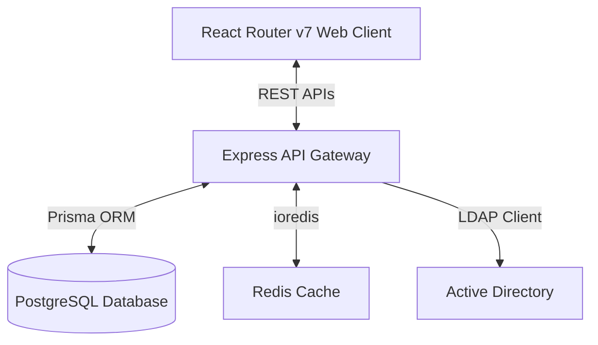

# Inventory Audit System (Stock Opname)

[](https://reactrouter.com/)
[](https://expressjs.com/)
[](https://www.prisma.io/)
[](https://www.postgresql.org/)
[](https://tailwindcss.com/)

A modern, high-concurrency inventory reconciliation and stock audit platform built to automate physical count tracking, compute stock discrepancies, and sync physical warehouse assets with ERP systems.

---

## 💼 Business Value & Real-World Impact

Discrepancies between system ledger inventory and physical shelf stocks are a primary source of shrinkages, unfulfilled orders, and lost sales. Traditionally, "Stock Opname" is done using paper logs and manual spreadsheets. **Inventory Audit System** solves this by:
* **Digital Scan Logging**: Staff audit warehouse inventory by scanning barcodes and registering counts directly to specific shelves/racks in real-time.
* **Instant Stock Reconciliation**: Automatically calculates matching items and discrepant records (`SESUAI` vs `SELISIH`), highlighting discrepancies immediately.
* **Discrepancy Resolution Workflows**: Allows administrators to delegate specific discrepant items back to operators for verification, or perform direct overriding corrections (`finalCorrectionQty`).
* **Active Directory Integration**: Simplifies large warehouse user access management through Active Directory (LDAP).

---

## 🛠️ Tech Stack & Architecture



### Backend
* **Express.js (TypeScript)**: Clean REST APIs compiled using `tsc` and executed via `tsx` / PM2.
* **Prisma ORM**: Relational modeling and database migration management.
* **PostgreSQL**: Transactional storage for audit sessions, scan logs, mapping databases, and audit logs.
* **LDAP JS Client**: Corporate Active Directory login fallback integration.

### Frontend
* **React Router v7**: The next-generation Remix framework implementation, utilizing React 19 and Vite.
* **Tailwind CSS v4**: Ultra-fast utility CSS engine using `@tailwindcss/vite`.
* **React Query & Zustand**: Data synchronization and client state control.
* **DaisyUI**: Premium components styling library.

---

## ⚙️ Core Workflows

### 1. Active Audit Sessions
All audit activities occur inside a scoped `OpnameSession`. When a session is created:
1. System pulls targeted SKUs or sets alerts using `SkuReminder` rules.
2. Operators scan items, assigning physical counts (`ScanLog`) mapped to specific shelf numbers (`rak`) and warehouse branches (`office`).

### 2. Discrepancy Reconciliation Engine
The system sums physical logs per SKU/rack and evaluates them against the ERP system ledger values:
$$\text{Physical Qty} = \sum(\text{ScanLog.qty})$$
* ** SESUAI (Matched)**: Physical Qty matches ERP System Qty.
* ** SELISIH (Discrepancy)**: Disparity found between counts.
* ** BELUM_COMPARE (Not compared)**: Waiting for final audit comparison.

### 3. Resolution Workflow
If a discrepancy is identified, admins can:
* **Re-audit Delegation**: Flags a SKU and assigns a specific operator to perform a blind recount.
* **Correction Override**: The warehouse manager enters a manually verified final quantity (`finalCorrectionQty`) that bypasses shelf-level logs, creating an authorized transition entry.

---

## ⚙️ Local Development Setup

### Backend Setup
1. Navigate to the backend directory:
   ```bash
   cd backend
   ```
2. Copy the environment template:
   ```bash
   cp .env.example .env
   ```
3. Install dependencies:
   ```bash
   pnpm install
   ```
4. Run Prisma migrations and start:
   ```bash
   npx prisma db push
   pnpm run dev
   ```

### Frontend Setup
1. Navigate to the frontend directory:
   ```bash
   cd ../frontend
   ```
2. Copy the environment template:
   ```bash
   cp .env.example .env.local
   ```
3. Install dependencies:
   ```bash
   pnpm install
   ```
4. Run the Vite/React Router development server:
   ```bash
   pnpm run dev
   ```
